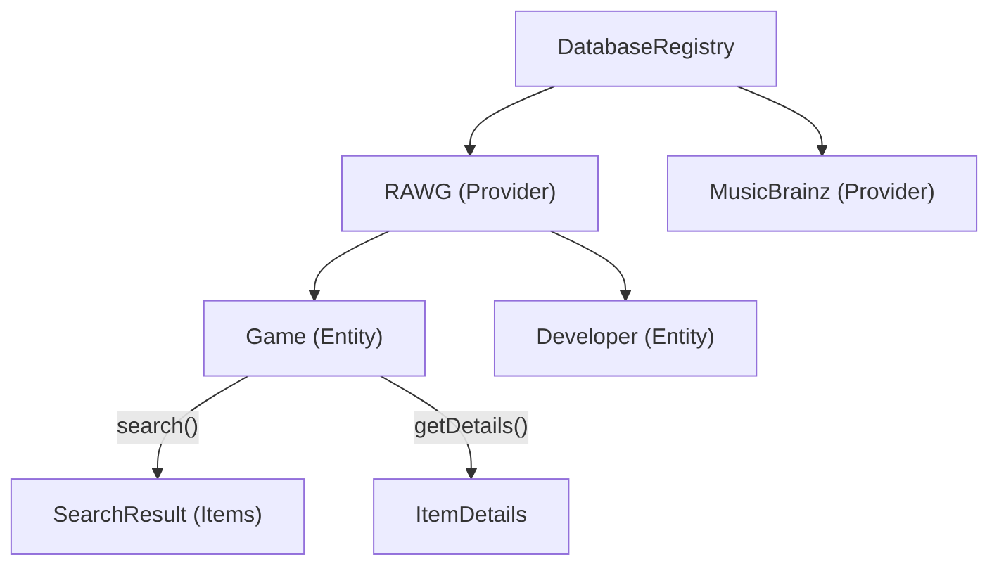
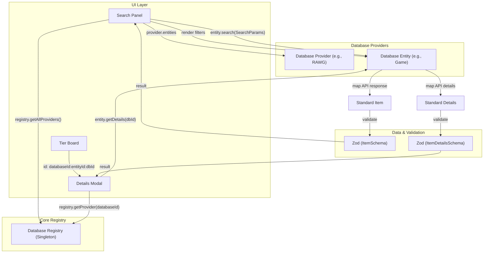

# V2 Database-Centric Interface Design (Comprehensive)

This document provides a detailed technical reference for the V2 service/database layer. The architecture shifts away from global "Media Type" categories (Music, Cinema, etc.) to a unified, database-centric approach where each data source is an independent, self-describing provider.

## 1. Core Principles

### Locality of Behavior (LoB)
In V1, adding a database required touching multiple layers of the application (Enums, Registry, Mappers, Search UI). V2 centralizes all logic for a specific data source within a single `DatabaseProvider`. This includes:
- API communication logic.
- Filter and sort definitions.
- Data transformation (mapping).
- UI branding (icons, colors).

### Decoupling via Standardization
The Board UI and Search Panel are completely decoupled from external API schemas. They only interact with the `Item` and `DatabaseProvider` interfaces. This "Thin Interface" allows the core application to remain stable even as external APIs evolve or new databases are added.

### Type-Safe Boundaries (Zod)
Every piece of data entering the system is validated via Zod. This prevents "silent data corruption" where malformed API responses cause crashes in distant UI components.



---

## 2. Architecture Diagram

The flowchart below illustrates the interaction between the UI, the Database Registry, and the individual Database Providers.



## 3. The Data Model: `Item`

The `Item` is the universal value object for the application.

- **`id`**: A composite string `${databaseId}:${entityId}:${dbId}`. This acts as a "Self-Routing Key" that tells the app exactly which provider/entity to use for further actions (like details).
- **`title`**: The primary display name.
- **`images`**: An array of `ImageSource` objects (URLs or References).
- **`subtitle` & `tertiaryText`**: These are **pre-computed** by the provider. 
  - *Example*: For an Album, the provider might set `subtitle` as "Pink Floyd • 1973". 
  - *Benefit*: The UI doesn't need to know that Albums have artists and years, while Books have authors. It just renders the string.
- **`rating`**: A normalized numeric value (0-100) for consistent visual representation (stars, bars, etc.).

---

## 4. The Provider Hierarchy

The architecture follows a two-level hierarchy:

### `DatabaseProvider`
The top-level object representing a service (e.g., RAWG, MusicBrainz).
- **`id` & `label`**: Identification for the UI.
- **`entities`**: A collection of specific data types supported by this provider.
- **`initialize()`**: An optional hook for setup logic like authentication or API key checks.

### `DatabaseEntity`
Represents a specific category of data (e.g., "Game", "Developer").
- **`filters`**: An array of `FilterDefinition` objects. These are **declarative**, meaning the UI (Search Panel) loops through them to draw inputs (text, select, range) without knowing their purpose.
- **`sortOptions`**: List of supported orderings.
- **`search(params)`**: 
  - Takes `SearchParams` (query, filters, pagination).
  - Returns a `SearchResult` containing an array of `Item`s and `pagination` metadata.
- **`getDetails(dbId)`**: 
  - Fetches deep metadata.
  - Returns a `ItemDetails` object (which extends `Item` with descriptions, tags, and links).

---

## 5. The DatabaseRegistry

The Registry acts as a **Service Locator** (Singleton).

- **Discovery**: The `SearchPanel` uses `registry.getAllProviders()` to build the database selection UI.
- **Routing**: When an item on the board needs details, the app looks up the provider by its `databaseId` in the registry.
- **Registration**: Providers are registered at application startup, allowing for easy expansion.

---

## 6. Metadata and Context

### Composite IDs
The use of `databaseId:entityId:dbId` is critical for:
- **Global Uniqueness**: Preventing collisions between different databases (e.g., both ID '123').
- **Context Preservation**: An item on the board always "remembers" where it came from.

### Extended Data
The `ItemDetails` includes an `extendedData` record. This allows providers to pass arbitrary, specific metadata (e.g., "Metacritic Score" for games, "Tracklist" for albums) that specialized UI components can selectively render.

---

## 7. Registry Lifecycle & Ready State

Since providers can be asynchronous (e.g., fetching auth tokens during `initialize`), the `DatabaseRegistry` manages an explicit lifecycle.

### `RegistryStatus` & `ProviderStatus`
In addition to the global `RegistryStatus`, each provider maintains its own `ProviderStatus`.
- **`IDLE`**: Registered but not initialized.
- **`INITIALIZING`**: Setup logic is running.
- **`READY`**: API is ready for use.
- **`ERROR`**: Provider-specific failure (e.g., bad API key), isolated from other providers.

### `waitUntilReady()`
UI components can await this method to ensure they don't trigger searches before the system is stable.
```typescript
await registry.waitUntilReady();
// Now it's safe to use registry.getProvider('rawg').search(...)
```

---

## 8. Image Waterfall & Healing

In V2, we don't assume the first image is always the best or even available. We use a **Waterfall** approach for visual reliability.

### `images`
The `Item` contains an array of `ImageSource` objects.
- **URL Source**: A direct Choice (e.g., RAWG screenshot URL).
- **Reference Source**: A reference to an external provider (e.g. `wikidata:slug:elden-ring`) that a background service can use to "resolve" or "heal" a missing image on the fly.

### How it works in the UI:
1.  **Render**: `ItemCard` tries to load the first source in `images`.
2.  **Error**: If the image fails to load (443/404), the UI triggers an `onError` event.
3.  **Resolution**: The UI automatically tries the next item in `images`. If it's a "Reference Source", it calls `registry.resolveImageReference()` to fetch a fresh URL.

---

## 9. Standardized Error Handling

V2 replaces generic `throw new Error()` with a structured `DatabaseError` system. This allows the UI to react specifically to different failure modes.

### `DatabaseErrorCode`
Standardized codes for common issues:
- **`AUTH_ERROR`**: Invalid API key or expired token.
- **`RATE_LIMIT`**: Provider is blocking us (too many requests).
- **`NOT_FOUND`**: Item ID no longer exists in the source.
- **`VALIDATION_ERROR`**: API response doesn't match our Zod schema.
- **`SERVICE_UNAVAILABLE`**: External provider is down (5xx).

### `handleDatabaseError` Utility
A helper converts Zod errors and HTTP status codes into these standardized types:
```typescript
try {
  // ... fetching logic ...
} catch (error) {
  throw handleDatabaseError(error, 'rawg');
}
```

---

## 10. Declarative Filter Mapping

To remove boilerplate in the `search` method, V2 uses a declarative mapping system. Instead of manual `if` blocks, filters define their own mapping logic.

### `mapTo` & `transform`
Each `FilterDefinition` can include:
- **`mapTo`**: The key name the API expects (e.g., `platforms`).
- **`transform`**: A function to convert the UI value into the API string (e.g., converting a year range `{min, max}` into a RAWG date string `2020-01-01,2022-12-31`).

### The `applyFilters` Utility
A shared utility handles the logic:
```typescript
applyFilters(apiParams, params.filters, entity.filters);
```
- **Object Merging**: If `transform` returns an object, it is merged into the API parameters.
- **Default Behavior**: If no `transform` is present, it simply maps the value to the `mapTo` key.

### Query Modifiers via `searchOptions`

Not all filters are data filters. Some modify *how the query is interpreted* (e.g., fuzzy matching, precise search). To keep these semantically distinct from standard data filters (like Platform or Year), they are defined in a separate `searchOptions` array on the `DatabaseEntity`.

**How it works:**
- Standard filters live in `entity.filters` and render in the filter sidebar.
- Query modifiers live in `entity.searchOptions` and render inline with the search input.
- Both use the same `FilterDefinition` interface, meaning the `applyFilters()` utility can process both arrays identically.
- For providers like MusicBrainz where modifiers affect query construction (not API params), the entity's `search()` method reads them directly from `params.filters`.

**RAWG example** (maps directly to an API parameter):
```typescript
{
  filters: [ /* yearRange, platform */ ],
  searchOptions: [
    {
      id: 'precise',
      label: 'Precise Search',
      type: 'boolean',
      defaultValue: true,
      mapTo: 'search_precise',
    }
  ]
}
```

**MusicBrainz example** (consumed by the search method, not mapped to API params):
```typescript
{
  filters: [ /* country, type */ ],
  searchOptions: [
    {
      id: 'fuzzy',
      label: 'Fuzzy Search',
      type: 'boolean',
      defaultValue: true,
      // No mapTo — the search() method reads this from params.filters['fuzzy']
      // and uses it to construct the Lucene query string.
    }
  ]
}
```


## 11. Related Entities Navigation

A key feature of the V2 architecture is the ability for items to link to other entities **within the same database**. 

### `EntityLink`
The `ItemDetails` object can include a list of `relatedEntities`.
- **`label`**: The type of the link (e.g., "Developer", "Author", "Studio").
- **`name`**: The display name of the target (e.g., "FromSoftware").
- **`entityId` & `dbId`**: The routing information needed to navigate.

### How it's used in the UI:
1.  A user opens the details for **Elden Ring**.
2.  The UI sees a `relatedEntity` link for **FromSoftware** (Entity: `developer`).
3.  The UI renders a clickable link.
4.  When clicked, the `DetailsModal` simply calls `useDatabaseDetails('rawg', 'developer', '123')`.
5.  The UI "navigates" to the Developer details without the user ever leaving the modal or the current database context.

---

## 12. Dependency Injection (Fetcher)

In V1, providers imported `secureFetch` directly. In V2, we adopt **Dependency Injection** by passing a `fetcher` to the provider.

- **How it works**: The `DatabaseRegistry` (or the `initialize` hook) provides a standard fetcher to each provider.
- **Why it matters**: 
  - **Mock-Free Testing**: Unit tests can pass a simple mock function instead of the real networking stack.
  - **Environment Flexibility**: We can provide a different fetcher for Server-Side Rendering (SSR) vs. Client-Side, or add specific logging/tracing headers globally without touching the provider code.

---

## 13. Zod Validation Strategy

Validation happens at the **Service Boundary**.

1. **Mapping**: The provider maps raw JSON to a `Item` object.
2. **Validation**: The provider calls `ItemSchema.parse(item)`.
3. **Safety**: If validation fails, an error is thrown early, preventing invalid state from being saved to the Board or Registry (IndexedDB).

---

## 14. Stability and Debouncing

To ensure a smooth user experience and prevent unnecessary API pressure, the V2 hooks implement a "Stability-First" strategy.

### Deep-Equal Debouncing
The `useDatabaseSearch` hook uses `use-debounce` with a `deepEqual` equality function. 
- **The Problem**: React re-renders can create new object references for filters or parameters even if their content hasn't changed. A standard debounce would reset the timer every time, causing a delay in searching.
- **The Solution**: By using `deepEqual`, the debounce timer only resets when the *values* inside the parameters actually change. This ensures that the search is triggered exactly `debounceMs` after the last meaningful user interaction.

---

## 15. Cancellation and Resource Management

All V2 data fetching methods are designed to be cancellable using the standard `AbortSignal` pattern.

### Why it Matters
- **Race Conditions**: If a user types quickly and search results arrive out of order, the UI might display stale data.
- **Resource Usage**: Cancelling pending requests saves bandwidth and server processing power.

### Implementation
- **Providers**: `search` and `getDetails` methods accept an optional `AbortSignal` and pass it down to the `Fetcher`.
- **Hooks**: `useSWR` provides a `signal` in its fetcher arguments, which the hooks automatically propagate to the underlying provider.

---

## 16. The React Integration Layer (Hooks)

While the `DatabaseRegistry` handles the core logic, a specialized **Hooks Layer** is used to make this data reactive within React components.

### `useDatabaseSearch(providerId, entityId, params)`
This hook provides a reactive interface for searching:
- **Internal SWR**: Handles caching, revalidation, and loading/error states.
- **Search Logic**: It looks up the entity in the registry and calls its `search` method.
- **Debouncing**: Automatically debounces query changes (using deep-comparison) to prevent over-fetching.
- **Cancellation**: Automatically cancels pending requests when the search parameters change or the component unmounts.

### `useDatabaseDetails(databaseId, entityId, dbId)`
A hook to fetch deep metadata for any item:
- **Routing**: Uses the `databaseId` and `entityId` to find the correct `getDetails` method.
- **Cache Key**: Uses the composite ID (`dbId:entityId:databaseId`) for local storage and SWR caching.
- **Cancellation**: Cancels the fetch if the request ID changes or the component unmounts.


## 17. Board Integration

The `Item` is designed to be the single source of truth for items stored on a board.

### Storage and Serialization
When an item is added to a tier, the entire `Item` object is serialized and stored in the `TierListState`. This ensures that the board remains interactive even if the external service is offline.

### Background Enrichment
The `MediaRegistry` (IndexedDB) acts as a local cache. When a board is loaded, the app can:
1. Render the stored `Item` immediately.
2. Trigger an asynchronous `getDetails()` call via the `DatabaseRegistry` to update the local metadata (e.g., fresh ratings, updated tags).
3. Update the `MediaRegistry` with the latest data.

### Extended Data Usage
`ItemDetails.extendedData` is a key-value store for database-specific attributes.
- **Provider Role**: Populate `extendedData` with fields that don't fit the `Item` but are useful for specialized views (e.g., "Developer Notes", "Original Language").
- **UI Role**: Specialized detail components can check for the presence of specific keys in `extendedData` to render custom UI blocks without bloating the standard model.

---

## 18. Migration Path

- **Hooks Layer**: Create `useDatabaseSearch` to handle SWR/pagination centrally.

# To be processed or decided later
## Out of scope for now
- Client sort (no client sort for now)
- Discovery mode (no discovery mode for now)
- Dates of items (no dates for now)

## Migration process
- We acknowledge broken boards and will not try to fix them.
- We will provide a way to delete all boards.

## Pending tasks
- Complete the migration of all V1 services to the V2 architecture.


