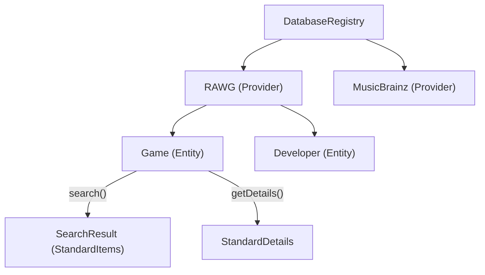
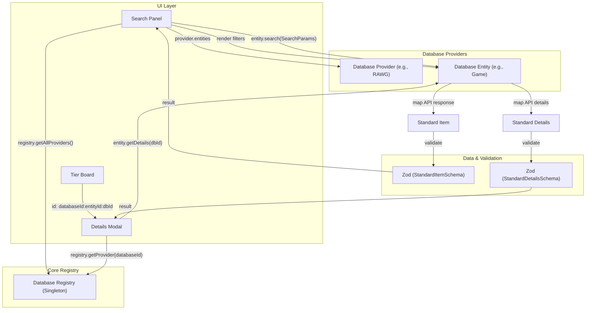

# V2 Database-Centric Interface Design (Comprehensive)

This document provides a detailed technical reference for the V2 service/database layer. The architecture shifts away from global "Media Type" categories (Music, Cinema, etc.) to a unified, database-centric approach where each data source is an independent, self-describing provider.

## 1. Core Principles

### Locality of Behavior (LoB)
In V1, adding a database required touching multiple layers of the application (Enums, Registry, Mappers, Search UI). V2 centralizes all logic for a specific data source within a single `DatabaseProvider`. This includes:
- API communication logic.
- Filter and sort definitions.
- Data transformation (mapping).
- UI branding (icons, colors).

### Decoupling via Standardization
The Board UI and Search Panel are completely decoupled from external API schemas. They only interact with the `StandardItem` and `DatabaseProvider` interfaces. This "Thin Interface" allows the core application to remain stable even as external APIs evolve or new databases are added.

### Type-Safe Boundaries (Zod)
Every piece of data entering the system is validated via Zod. This prevents "silent data corruption" where malformed API responses cause crashes in distant UI components.



---

## 2. Architecture Diagram

The flowchart below illustrates the interaction between the UI, the Database Registry, and the individual Database Providers.



## 3. The Data Model: `StandardItem`

The `StandardItem` is the universal value object for the application.

- **`id`**: A composite string `${databaseId}:${entityId}:${dbId}`. This acts as a "Self-Routing Key" that tells the app exactly which provider/entity to use for further actions (like details).
- **`title`**: The primary display name.
- **`imageUrl`**: The primary visual asset.
- **`subtitle` & `tertiaryText`**: These are **pre-computed** by the provider. 
  - *Example*: For an Album, the provider might set `subtitle` as "Pink Floyd • 1973". 
  - *Benefit*: The UI doesn't need to know that Albums have artists and years, while Books have authors. It just renders the string.
- **`rating`**: A normalized numeric value (0-100) for consistent visual representation (stars, bars, etc.).

---

## 3. The Provider Hierarchy

The architecture follows a two-level hierarchy:

### `DatabaseProvider`
The top-level object representing a service (e.g., RAWG, MusicBrainz).
- **`id` & `label`**: Identification for the UI.
- **`entities`**: A collection of specific data types supported by this provider.
- **`initialize()`**: An optional hook for setup logic like authentication or API key checks.

### `DatabaseEntity`
Represents a specific category of data (e.g., "Game", "Developer").
- **`filters`**: An array of `FilterDefinition` objects. These are **declarative**, meaning the UI (Search Panel) loops through them to draw inputs (text, select, range) without knowing their purpose.
- **`sortOptions`**: List of supported orderings.
- **`search(params)`**: 
  - Takes `SearchParams` (query, filters, pagination).
  - Returns a `SearchResult` containing an array of `StandardItem`s.
- **`getDetails(dbId)`**: 
  - Fetches deep metadata.
  - Returns a `StandardDetails` object (which extends `StandardItem` with descriptions, tags, and links).

---

## 4. The `DatabaseRegistry`

The Registry acts as a **Service Locator** (Singleton).

- **Discovery**: The `SearchPanel` uses `registry.getAllProviders()` to build the database selection UI.
- **Routing**: When an item on the board needs details, the app looks up the provider by its `databaseId` in the registry.
- **Registration**: Providers are registered at application startup, allowing for easy expansion.

---

## 5. Metadata and Context

### Composite IDs
The use of `databaseId:entityId:dbId` is critical for:
- **Global Uniqueness**: Preventing collisions between different databases (e.g., both ID '123').
- **Context Preservation**: An item on the board always "remembers" where it came from.

### Extended Data
The `StandardDetails` includes an `extendedData` record. This allows providers to pass arbitrary, specific metadata (e.g., "Metacritic Score" for games, "Tracklist" for albums) that specialized UI components can selectively render.

---

## 3. Registry Lifecycle & Ready State

Since providers can be asynchronous (e.g., fetching auth tokens during `initialize`), the `DatabaseRegistry` manages an explicit lifecycle.

### `RegistryStatus` & `ProviderStatus`
In addition to the global `RegistryStatus`, each provider maintains its own `ProviderStatus`.
- **`IDLE`**: Registered but not initialized.
- **`INITIALIZING`**: Setup logic is running.
- **`READY`**: API is ready for use.
- **`ERROR`**: Provider-specific failure (e.g., bad API key), isolated from other providers.

### `waitUntilReady()`
UI components can await this method to ensure they don't trigger searches before the system is stable.
```typescript
await registry.waitUntilReady();
// Now it's safe to use registry.getProvider('rawg').search(...)
```

---

## 4. Image Waterfall & Healing

In V2, we don't assume the first image is always the best or even available. We use a **Waterfall** approach for visual reliability.

### `imageFallbacks`
The `StandardItem` contains an array of fallback sources.
- **Primary URL**: The first choice (e.g., RAWG screenshot).
- **Secondary URLs**: Alternative sources (e.g., Fanart.tv posters).
- **Healing IDs**: Local IDs like `wikidata:slug:elden-ring` that a background service can use to "heal" a missing image on the fly.

### How it works in the UI:
1.  **Render**: `MediaCard` tries to load the `imageUrl`.
2.  **Error**: If the image fails to load (443/404), the UI triggers an `onError` event.
3.  **Healing**: The UI automatically tries the next item in `imageFallbacks`. If it's a "Healing ID", it calls the corresponding database provider to fetch a fresh URL.

---

## 5. Standardized Error Handling

V2 replaces generic `throw new Error()` with a structured `DatabaseError` system. This allows the UI to react specifically to different failure modes.

### `DatabaseErrorCode`
Standardized codes for common issues:
- **`AUTH_ERROR`**: Invalid API key or expired token.
- **`RATE_LIMIT`**: Provider is blocking us (too many requests).
- **`NOT_FOUND`**: Item ID no longer exists in the source.
- **`VALIDATION_ERROR`**: API response doesn't match our Zod schema.
- **`SERVICE_UNAVAILABLE`**: External provider is down (5xx).

### `handleDatabaseError` Utility
A helper converts Zod errors and HTTP status codes into these standardized types:
```typescript
try {
  // ... fetching logic ...
} catch (error) {
  throw handleDatabaseError(error, 'rawg');
}
```

---

## 5. Declarative Filter Mapping

To remove boilerplate in the `search` method, V2 uses a declarative mapping system. Instead of manual `if` blocks, filters define their own mapping logic.

### `mapTo` & `transform`
Each `FilterDefinition` can include:
- **`mapTo`**: The key name the API expects (e.g., `platforms`).
- **`transform`**: A function to convert the UI value into the API string (e.g., converting a year range `{min, max}` into a RAWG date string `2020-01-01,2022-12-31`).

### The `applyFilters` Utility
A shared utility handles the logic:
```typescript
applyFilters(apiParams, params.filters, entity.filters);
```
- **Object Merging**: If `transform` returns an object, it is merged into the API parameters.
- **Default Behavior**: If no `transform` is present, it simply maps the value to the `mapTo` key.

---

## 6. Related Entities Navigation

A key feature of the V2 architecture is the ability for items to link to other entities **within the same database**. 

### `EntityLink`
The `StandardDetails` object can include a list of `relatedEntities`.
- **`label`**: The type of the link (e.g., "Developer", "Author", "Studio").
- **`name`**: The display name of the target (e.g., "FromSoftware").
- **`entityId` & `dbId`**: The routing information needed to navigate.

### How it's used in the UI:
1.  A user opens the details for **Elden Ring**.
2.  The UI sees a `relatedEntity` link for **FromSoftware** (Entity: `developer`).
3.  The UI renders a clickable link.
4.  When clicked, the `DetailsModal` simply calls `useDatabaseDetails('rawg', 'developer', '123')`.
5.  The UI "navigates" to the Developer details without the user ever leaving the modal or the current database context.

---

## 7. Dependency Injection (Fetcher)

In V1, providers imported `secureFetch` directly. In V2, we adopt **Dependency Injection** by passing a `fetcher` to the provider.

- **How it works**: The `DatabaseRegistry` (or the `initialize` hook) provides a standard fetcher to each provider.
- **Why it matters**: 
  - **Mock-Free Testing**: Unit tests can pass a simple mock function instead of the real networking stack.
  - **Environment Flexibility**: We can provide a different fetcher for Server-Side Rendering (SSR) vs. Client-Side, or add specific logging/tracing headers globally without touching the provider code.

---

## 7. Zod Validation Strategy

Validation happens at the **Service Boundary**.

1. **Mapping**: The provider maps raw JSON to a `StandardItem` object.
2. **Validation**: The provider calls `StandardItemSchema.parse(item)`.
3. **Safety**: If validation fails, an error is thrown early, preventing invalid state from being saved to the Board or Registry (IndexedDB).

---

## 7. The React Integration Layer (Hooks)

While the `DatabaseRegistry` handles the core logic, a specialized **Hooks Layer** is used to make this data reactive within React components.

### `useDatabaseSearch(providerId, entityId, params)`
This hook provides a reactive interface for searching:
- **Internal SWR**: Handles caching, revalidation, and loading/error states.
- **Search Logic**: It looks up the entity in the registry and calls its `search` method.
- **Debouncing**: Automatically debounces query changes to prevent over-fetching.

### `useDatabaseDetails(databaseId, entityId, dbId)`
A hook to fetch deep metadata for any item:
- **Routing**: Uses the `databaseId` and `entityId` to find the correct `getDetails` method.
- **Cache Key**: Uses the composite ID (`dbId:entityId:databaseId`) for local storage and SWR caching.

---

## 8. Migration Path

- **Hooks Layer**: Create `useDatabaseSearch` to handle SWR/pagination centrally.
- **Related Entities**: Allow items to link to other entities (e.g., a Game links to its Developer entity) for deep navigation within the app.
